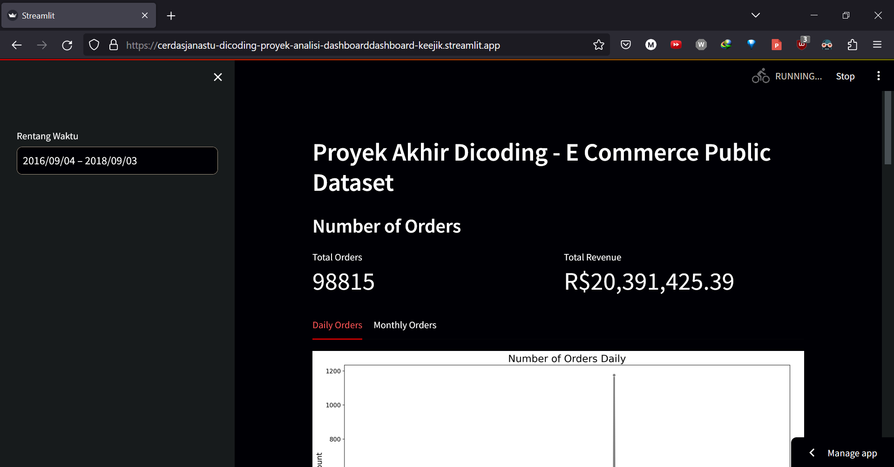
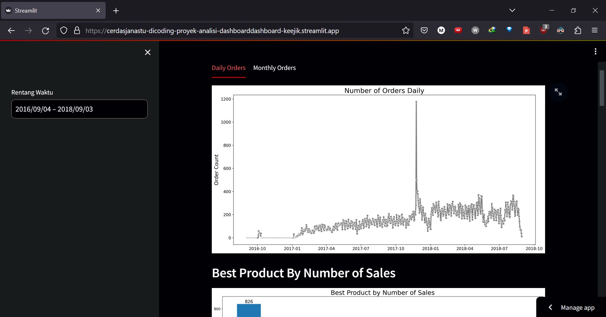
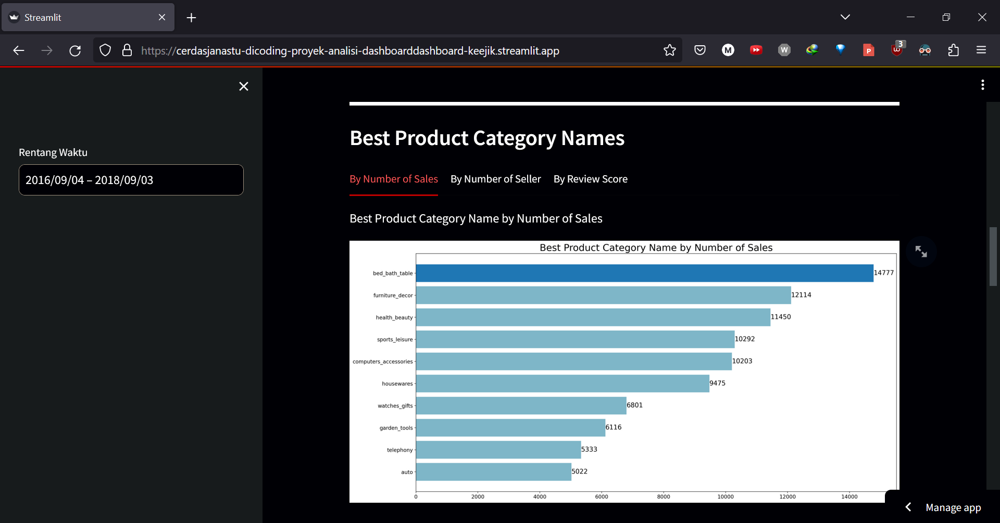
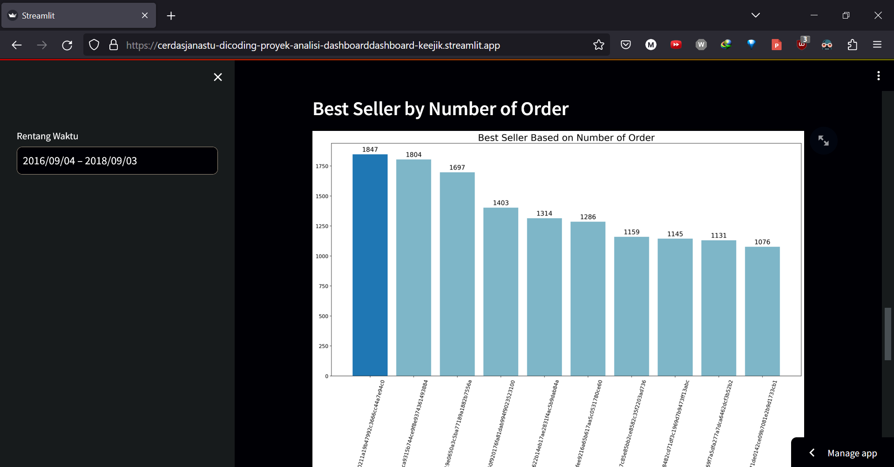

# Proyek Akhir Dicoding: Belajar Analisis Data dengan Python

## Data e-commerce public dataset
[data source](https://www.kaggle.com/datasets/olistbr/brazilian-ecommerce)

## Set up Environment
```
conda create --name main-ds python=3.9
conda activate main-ds
```
Install required packages
```
pip install -r requirements.txt
```


## Run streamlit app
```
streamlit run dashboard/dashboard.py
```

## Deployed streamlit app
[streamlit app](https://cerdasjanastu-dicoding-proyek-analisi-dashboarddashboard-keejik.streamlit.app/)

screenshot



